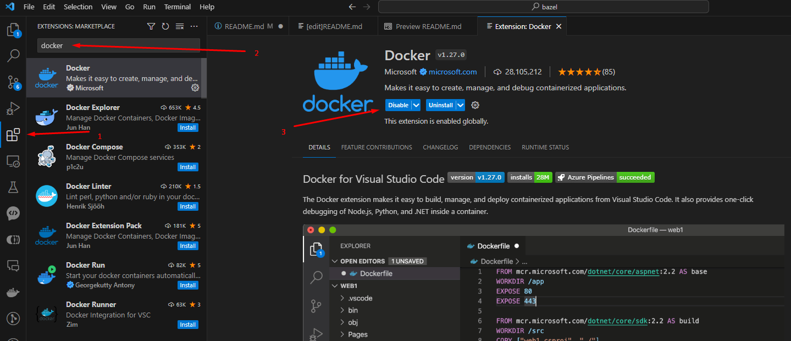
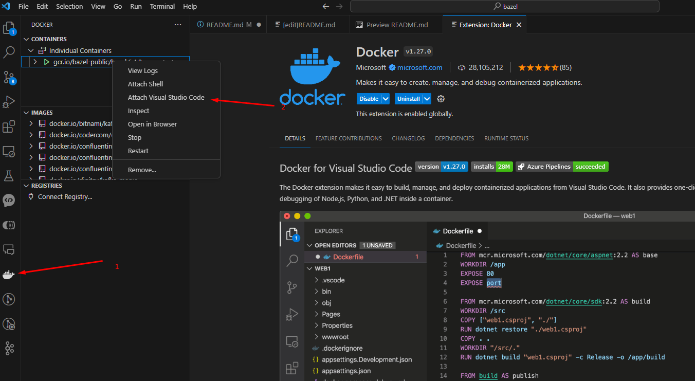
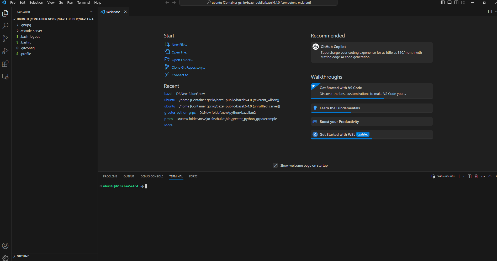
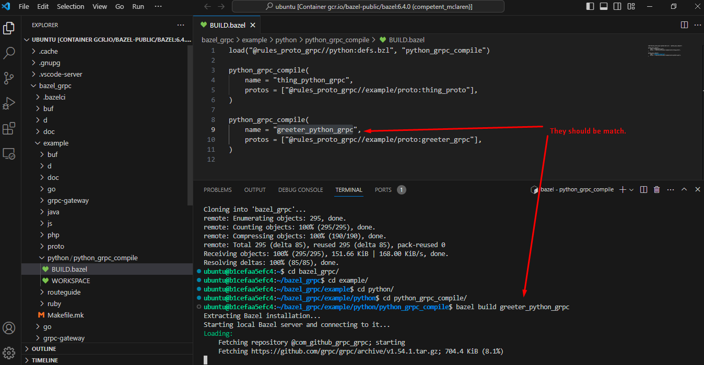
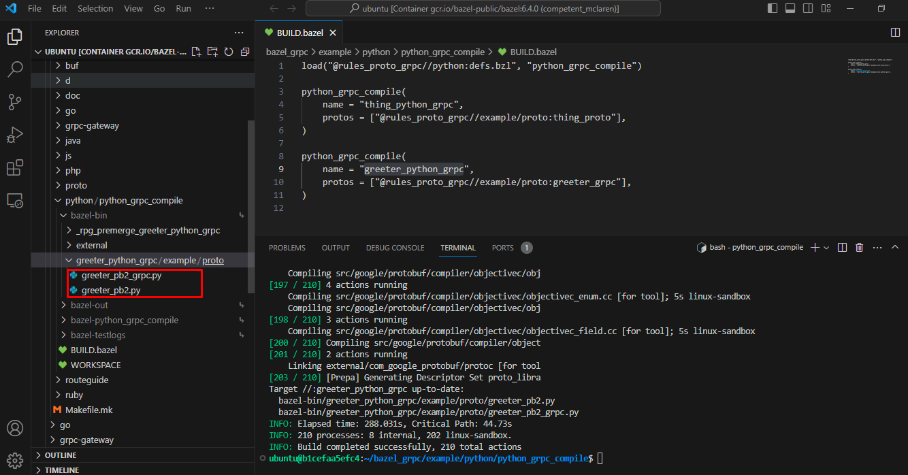

# gRPC Bazel Project

This project generates the gRPC servers for

* Java
* Python
* NodeJS
* Ruby
* Go

using Bazel Compiler.

## How to use

Main project files are located in example folder. Others are libraries for it.

In example/proto folder, there is proto file(greeter.proto). We will generate gRPC server for this proto file.

I personally like Docker, so it is used to use bazel(In my experience building local bazel environment was cubersome!)

1. check docker is intalled

   type following in terminal

   ```
   docker version
   ```

   if version is displayed, you may proceed. If not, you should install Docker or skip it and try on local environment.
2. Pull and Run Bazel Docker Instance

   ```
   docker run --interactive --entrypoint=/bin/bash gcr.io/bazel-public/bazel:6.4.0
   ```

   It will pull bazel docker image from docker hub and run container.

   You can check if it is running on terminal.

   ```
   docker ps
   ```

   You will see running container.

   Now it is time to connect to bazel docker container using VSCode.
3. Connect Container and work

   You should install VSCode docker extension.

   

   After it is installed, you will see docker icon on left sidebar.

   If it is clicked, Containers tab will be displayed. Right-click on bazel container and Press 'Attach Visual Studio Code'.

   

   It will open new vscode window. Open termianl in it by pressing "ctrl + ~".

   You will see Ubuntu terminal running on bazel container.

   

   Now it is time to clone github repo in it.

   ```
   git clone https://github.com/ihortecker/bazel_grpc.git

   cd bazel_grpc

   cd example

   cd python

   cd python_grpc_compile

   bazel build greeter_python_grpc


   ```

   

   It will take several minutes to finish.

   After it is finished, you can find output files.

   

   For other languages, you can iterate previous steps to compile.

---

## Testing

At this moment, you may have a question if these generated services will work as we expected.

So I emulated real server / client using these services. (in test folder)
